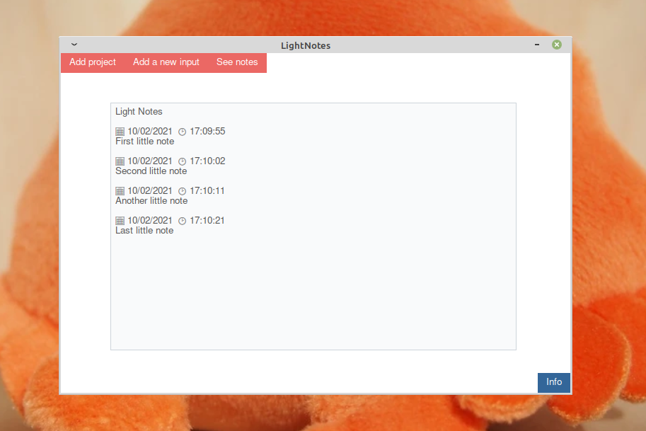

# LightNotes
**WARNING**: This project is a work in progress

A note-taking system for project management based on little insights written in Python. 


## Instalation 
1. Clone the repository

```bash
git clone https://github.com/HicaroD/LightNotes.git && cd LightNotes
```

2. Install all required dependencies 

```bash
pip3 install -r requirements.txt
```

3. Execute the program 
```bash
cd src/ && python3.8 main.py
```

## Usage 

## License 
[MIT](./LICENSE)

